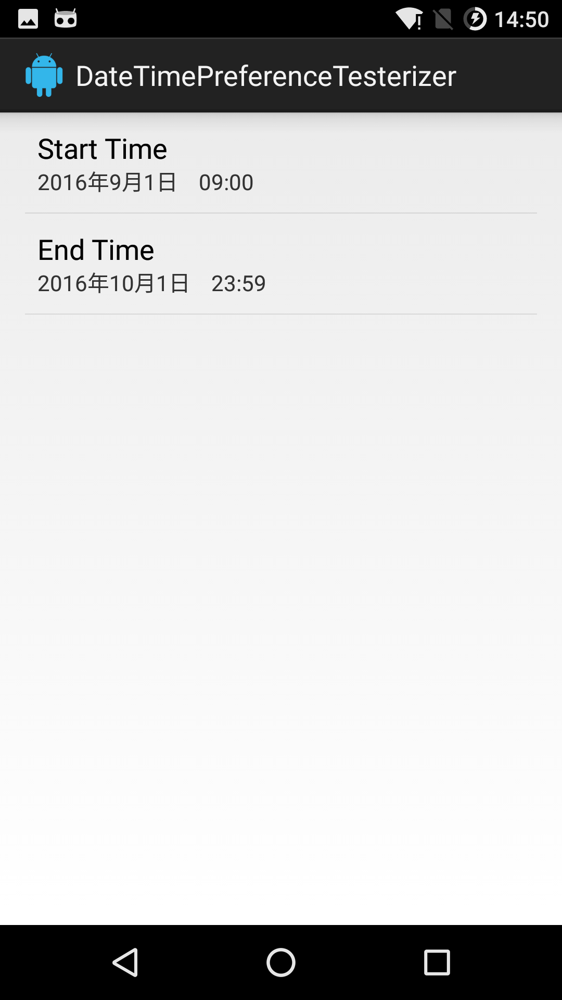
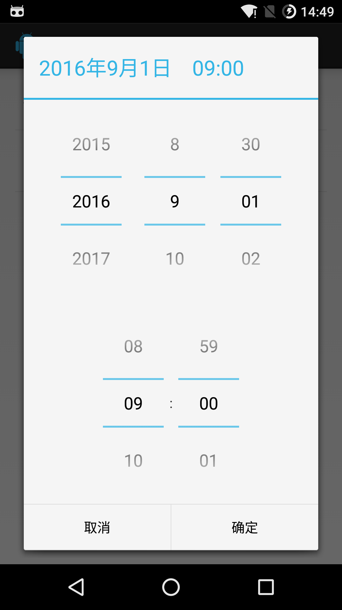

# DateTimePreference

## Description

> A DateTimePreference, analogous to [DatePreference](https://github.com/bostonandroid/DatePreference) or [TimePreference](https://github.com/bostonandroid/TimePreference)

## Screenshots

<a href="">
  
</a>

<a href="">
  
</a>

## Usage

* In Eclipse with your project open:

  1. In the Package Explorer right click on your project and select "Properties".
  2. Select "Java Build Path" -> "Libraries".
  3. "Add External JARs..." then select the DateTimePreference.jar file.

* In your activity that descends from PreferenceActivity:

    ``` java
      import com.unclesunny.datetimepreference.DateTimePreference;
    ```
  
* In your preference XML:

    ``` xml
      <com.unclesunny.datetimepreference.DateTimePreference
         android:key="start_time"
         android:title="Start Time" />
    ```

* To quickly get the Date and Time selected for "start_time", in your PreferenceActivity:

    ``` java
    DateTimePreference.getDateTimeFor(
    PreferenceManager.getDefaultSharePreferences(this),
    "start_time");
    ```

* To set the date and time use `.setDateTime(String)`.

* To make the JAR:

  With just the DateTimePreference source code loaded in Eclipse:

  In the Package Explorer right click on the "default.jardesc" file and select "Create JAR"
